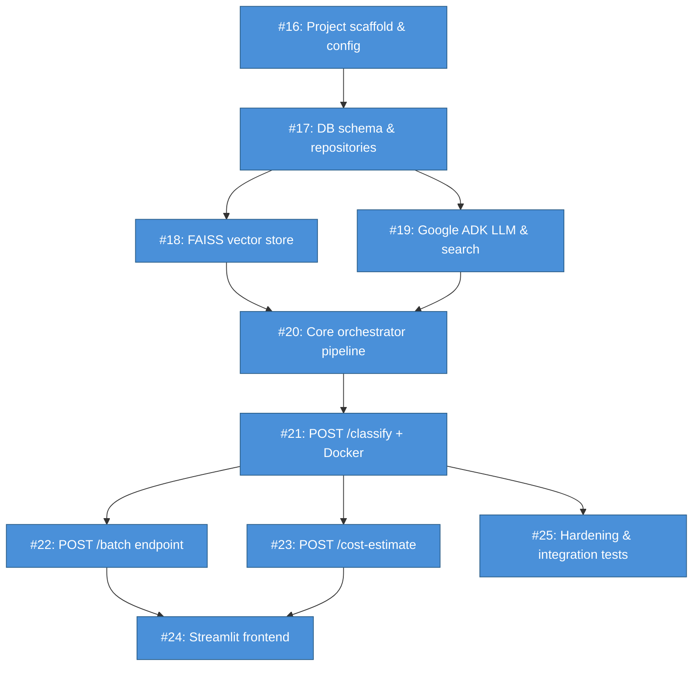

# Issues: FranklinAgent — AI Merchant Classification Agent

PRD: #15

## Dependency graph



**Legend:** Blue = AFK (no human required) · Yellow = HITL (human decision needed)

## Issue index

| # | Title | Type | Blocked by |
|---|-------|------|------------|
| #16 | Project scaffold & configuration system | AFK | — |
| #17 | Database schema, seed data & repositories | AFK | #16 |
| #18 | FAISS vector store & embedding provider | AFK | #17 |
| #19 | Google ADK LLM & search provider | AFK | #17 |
| #20 | Core 7-step orchestrator pipeline | AFK | #17, #18, #19 |
| #21 | POST /classify + GET /health FastAPI endpoints & Docker | AFK | #20 |
| #22 | Batch mode — POST /batch endpoint | AFK | #21 |
| #23 | Cost estimation — POST /cost-estimate endpoint | AFK | #21 |
| #24 | Streamlit demo frontend | AFK | #21, #22, #23 |
| #25 | Hardening: alternate provider stubs, integration tests & logging | AFK | #21 |
```
